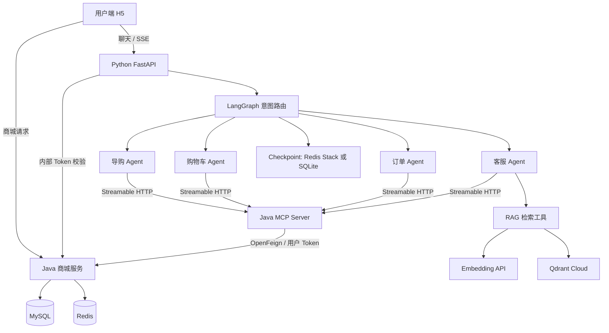

# Mall4j Learning Workspace

基于 Mall4j 的商城学习与 AI 智能体实践工作区，集成 Java 商城后端、多端前端、Python Agent、Java MCP Server 和 Qdrant 客服知识库。

> 本项目用于学习、功能验证与二次开发，不是 Mall4j 官方发布仓库，也不代表上游项目立场。当前 AI 功能主要在 H5 用户端联调，生产使用前需要完善业务审核、运行监控和部署配置。

## 目录

- [项目介绍](#项目介绍)
- [功能概览](#功能概览)
- [系统架构](#系统架构)
- [技术栈](#技术栈)
- [目录结构](#目录结构)
- [快速开始](#快速开始)
- [RAG 知识库](#rag-知识库)
- [API 与流式协议](#api-与流式协议)
- [Docker 部署](#docker-部署)
- [测试与验证](#测试与验证)
- [已知限制与规划](#已知限制与规划)
- [文档导航](#文档导航)
- [贡献说明](#贡献说明)
- [来源与许可](#来源与许可)

## 项目介绍

本仓库把商城交易链路与 AI 对话能力放在同一个工作区中，实践从自然语言意图识别到业务工具执行的完整流程：

- 商城提供商品、SKU、购物车、订单、地址及后台管理等基础业务。
- Python 服务通过 LangGraph 路由到导购、购物车、订单或客服 Agent。
- Java MCP Server 将商城 REST API 封装为智能体工具。
- 客服 Agent 使用 Qdrant Cloud 检索中文知识文档，回答通用规则和流程问题。
- 前端使用标准 SSE 展示文本增量，并支持会话恢复与危险动作审批。

### 在线体验

- 用户端：[https://mall.zpzhub.shop](https://mall.zpzhub.shop)
- 测试账号：`color`
- 测试密码：`123456789`

该账号为共享功能测试账号，请勿录入个人敏感信息或用于正式业务。在线环境的可用能力取决于当前部署版本，可能与工作区开发进度不同。

## 功能概览

| 模块 | 当前能力 |
| --- | --- |
| 商城业务 | 商品与 SKU、购物车、订单、地址、用户及后台管理等基础能力 |
| 多 Agent 路由 | 结构化意图识别，路由到 `shopping`、`cart`、`order`、`customer` |
| MCP 工具 | 商品、购物车、订单、客服和地址等工具分组 |
| 用户身份 | Python 调用 Java 内部鉴权接口，业务工具携带当前用户 Token |
| 标准 SSE | 处理阶段、工具执行、文本增量、审批和结束事件 |
| 会话记忆 | 用户与会话组合的 `thread_id`，支持多轮对话和历史回显 |
| HITL | 按工具策略对危险动作暂停，用户批准或拒绝后恢复执行 |
| 中间件 | 模型重试、指定工具重试、模型及工具调用次数限制 |
| 客服 RAG | 中文 Markdown 加载、切片、向量入库、检索及中文来源展示 |
| H5 交互 | 新对话、流式消息、历史回显、内嵌审批交互 |

## 系统架构



### 鉴权与会话

- 用户端聊天请求直接到 Python 服务；部署时可以经过同源反向代理，不由 Java 代传聊天流。
- Python 调用 Java 的 `/internal/auth/introspect` 获取用户上下文。
- `MALL_AGENT_AUTH_TOKEN` 是 Java 与 Python 内部鉴权接口的共享服务凭据，不是用户登录 Token，不应发送给前端。
- 当前用户凭据通过 Python `ContextVar` 传递给 MCP 工具加载逻辑；业务接口继续执行用户归属和权限检查。
- Checkpoint 使用 `user:{user_id}:conversation:{conversation_id}` 区分用户与会话。前端只传会话 ID，用户 ID 由后端鉴权确定。
- Redis/SQLite 保存图状态和对话；Qdrant 保存知识向量，两者职责独立。

## 技术栈

以下版本依据仓库依赖声明整理，实际安装版本以锁文件和各组件配置为准。

| 层级 | 技术 |
| --- | --- |
| 商城后端 | Java 17、Spring Boot 4.0.3、Sa-Token、MyBatis-Plus、Redis/Redisson、MySQL |
| MCP Server | Java 17、Spring Boot 4.1.1、Spring AI 2.0.1、OpenFeign、MCP Streamable HTTP |
| AI 服务 | Python 3.13+、FastAPI、LangChain 1.4+、LangGraph 1.2+、langchain-mcp-adapters |
| 模型接入 | OpenAI-compatible Chat/Embedding API、langchain-openai |
| 知识检索 | langchain-qdrant、Qdrant Cloud、Dense/Cosine 检索 |
| 会话持久化 | Redis Stack Checkpointer；部署可选择 SQLite Checkpointer |
| 管理端 | Vue 3、Vite、Element Plus、Pinia |
| 用户端 | Vue 3、uni-app、Vite、markstream-vue |
| 工程工具 | uv、Maven、pnpm、Docker Compose |

结构化模型统一发送 `thinking.type=disabled`，以响应速度为主；普通业务模型保留其原有配置。使用其他模型服务时，请核对该服务对 GLM 扩展参数及严格结构化输出的支持。

## 目录结构

```text
.
├── README.md
├── docker-compose.yml          # 工作区部署编排
├── mall4j/                     # Java 商城、数据库脚本与上游资料
├── mall-mcp-server/             # 独立 Java MCP Server
│   └── docs/                   # MCP 实践文档
├── mall-agent/
│   ├── app/
│   │   ├── agents/             # 各业务 Agent 与 tool_policy
│   │   ├── auth/               # Java 鉴权与请求上下文
│   │   ├── core/               # 配置、聊天模型、Embedding
│   │   ├── graph/              # 主 Graph、状态与业务节点
│   │   ├── memory/             # Checkpointer
│   │   ├── rag/                # loader、splitter、ingest、retriever
│   │   ├── tools/              # 本地知识库工具
│   │   ├── schemas/            # 请求、响应与 SSE 事件
│   │   └── main.py             # FastAPI 入口
│   ├── knowledge/              # 中文客服 Markdown 文档
│   ├── docs/                   # 会话记忆、中间件与 HITL 文档
│   ├── tests/
│   ├── .env.example
│   └── pyproject.toml
└── front-end/
    ├── mall4v/                 # Vue 管理后台
    ├── mall4uni/               # uni-app 用户端，AI 当前以 H5 为主
    └── mall4m/                 # 原生微信小程序
```

## 快速开始

### 1. 准备环境

- Java 17、Maven。
- Python 3.13+、uv。
- Node.js `^20.19.0` 或 `>=22.12.0`、pnpm 7+。
- MySQL、Redis；开发环境使用 Redis Checkpointer 时，需要支持 RedisJSON 和 RediSearch 的 Redis Stack。
- 支持工具调用与结构化输出的模型服务，以及可用的 Embedding API。
- Qdrant Cloud 集群 Endpoint 和 Database API Key。

```bash
git clone https://github.com/colorarr/mall4j-learning-workspace.git
cd mall4j-learning-workspace
```

### 2. 启动商城后端

1. 导入 [`mall4j/db/yami_shop.sql`](mall4j/db/yami_shop.sql)。数据库名称应与当前 profile 配置一致。
2. 配置 [`application-dev.yml`](mall4j/yami-shop-admin/src/main/resources/application-dev.yml) 中的数据库与 Redis 连接。
3. 设置 Java/Python 共用的 `MALL_AGENT_AUTH_TOKEN`，替换示例值后在启动终端导出。

```bash
export MALL_AGENT_AUTH_TOKEN='REPLACE_WITH_SHARED_SERVICE_SECRET'
cd mall4j
mvn -pl yami-shop-admin -am clean package -DskipTests
java -jar yami-shop-admin/target/yami-shop-admin-0.0.1-SNAPSHOT.jar \
  --spring.profiles.active=dev
```

也可以在 IDE 中启动 `com.yami.shop.admin.WebApplication`，并在运行配置中注入同一服务凭据。当前开发 profile 使用 `18080` 端口；Docker profile 使用 `8080`，请同步调整各组件地址。

### 3. 启动 MCP Server

在工作区根目录的新终端执行：

```bash
cd mall-mcp-server
MALL4J_BASE_URL=http://127.0.0.1:18080 mvn spring-boot:run
```

验证服务：

```bash
curl http://127.0.0.1:18081/actuator/health
```

`/mcp` 是协议端点，不是普通网页；工具发现和调用需使用 MCP 客户端。

### 4. 配置并启动 Python Agent

在工作区根目录的新终端执行：

```bash
cd mall-agent
cp .env.example .env
uv sync
```

编辑 `.env`，至少完成以下配置：

| 配置项 | 用途 |
| --- | --- |
| `MODEL_NAME`、`BASE_URL`、`API_KEY` | 聊天与结构化模型 |
| `TAVILY_API_KEY` | 当前 Settings 必填配置；不表示每轮客服问答使用网页搜索 |
| `JAVA_AUTH_INTROSPECT_URL` | 本地开发设为 `http://127.0.0.1:18080/internal/auth/introspect` |
| `MALL_AGENT_AUTH_TOKEN` | 与 Java 一致的内部共享服务凭据 |
| `MCP_SERVER_URL` | 默认 `http://127.0.0.1:18081/mcp` |
| `CHECKPOINT_BACKEND`、`REDIS_URL` | 本地 Redis Stack 会话存储，backend 设为 `redis` |
| `EMBEDDING_MODEL`、`EMBEDDING_BASE_URL`、`EMBEDDING_API_KEY` | 文档及问题的向量模型 |
| `QDRANT_BASE_URL`、`QDRANT_API_KEY` | Qdrant Cloud Endpoint 与 Database API Key |
| `QDRANT_COLLECTION`、`RAG_TOP_K` | 专用知识集合及检索数量，建议集合名 `mall_knowledge` |

示例中的商城地址和集合名称可能与本地配置不同，所有组件应使用一致的实际值。`.env` 不提交到 Git，API Key 仅由后端持有。

```bash
uv run uvicorn app.main:app --host 127.0.0.1 --port 18082 --reload
```

如选择 SQLite：先执行 `uv sync --extra sqlite-checkpoint`，设置 `CHECKPOINT_BACKEND=sqlite`，并将 `LANGGRAPH_SQLITE_PATH` 指向存在且可写的目录。

### 5. 启动前端

H5 用户端，在工作区根目录的新终端执行：

```bash
cd front-end/mall4uni
pnpm install
pnpm run dev:h5
```

当前 Vite 配置端口为 `5173`，`/agent-api` 代理到 `18082`。商城 API 地址在前端环境配置中设置为当前 Java 服务地址。

管理端，在工作区根目录的新终端执行：

```bash
cd front-end/mall4v
pnpm install
pnpm run dev
```

当前管理端配置端口为 `9527`。原生小程序请使用微信开发者工具打开 `front-end/mall4m`。

## RAG 知识库

当前知识库包含优惠券、售后、常见问题、支付、订单、账户和配送七个分类。

```text
knowledge/*/*.md
    → loader：读取文档并生成中文标题与来源 metadata
    → splitter：800 字符切片，100 字符重叠
    → ingest：Embedding + 稳定 UUID + Qdrant 写入
    → retriever：问题向量化，Top-K 相似度检索
    → search_customer_knowledge：客服 Agent 工具
```

在 `mall-agent` 目录执行：

```bash
# 检查加载与切片
uv run python -m app.rag.loader
uv run python -m app.rag.splitter

# 首次创建集合并导入；会调用 Embedding API 和写入云端
uv run python -m app.rag.ingest

# 检索及工具调用验证
uv run python -m app.rag.retriever
uv run python -m app.tools.knowledge
```

- 文档标题和分类由中文文件名、目录生成；正文不要求 YAML front matter。
- Qdrant 集合采用 Cosine 距离，维度由 Embedding 模型实际输出决定。
- 同一个 Chunk ID 使用稳定 UUID，重复导入覆盖同 ID 的 Point。
- 当前导入不自动清理已删除文档或重新切片后多余的旧 Point。
- 更换 Embedding 模型或维度后，应重新向量化并使用匹配的新集合。
- 相似度分数不是回答正确率；实时订单、物流、金额与退款状态应由业务工具查询。

## API 与流式协议

默认 Python 服务地址为 `http://127.0.0.1:18082`。除健康检查外，以下接口需要当前用户登录 Token。

| 方法 | 路径 | 说明 |
| --- | --- | --- |
| GET | `/health` | 进程健康检查，不代表所有下游依赖健康 |
| GET | `/chat` | 查看鉴权得到的用户上下文 |
| POST | `/chat` | 非流式兼容入口；前端主流程使用流式接口 |
| POST | `/chat/stream` | 标准 SSE 聊天 |
| GET | `/chat/history/{conversation_id}` | 当前用户指定会话的历史回显 |
| POST | `/chat/resume` | 提交 HITL 决定并以 SSE 恢复执行 |

示例：先设置 `USER_TOKEN` 为当前商城登录返回的有效 Token，再执行：

```bash
curl -N http://127.0.0.1:18082/chat/stream \
  -H "Authorization: $USER_TOKEN" \
  -H 'Content-Type: application/json' \
  -H 'Accept: text/event-stream' \
  -d '{"messages":"优惠券为什么在结算时用不了？","conversation_id":null}'
```

响应为 `text/event-stream`，帧格式示例：

```text
event: token
data: {"content":"优惠券"}

```

主要事件包括 `start`、`status`、`intent`、`agent_start`、`agent_end`、`tool_call`、`tool_start`、`tool_end`、`message_start`、`token`、`message_end`、`approval_required`、`done` 和 `error`。每帧以空行结束，前端逐帧解析并追加正文。

### 审批与恢复

1. 危险工具命中 HITL 策略，返回 `approval_required` 并暂停 Graph。
2. 前端显示审批交互，保存 `conversation_id`、`interrupt_id` 和动作顺序。
3. 用户选择批准或拒绝后，调用 `/chat/resume`。
4. 后端校验当前用户会话与中断信息，再恢复同一 Graph。

```json
{
  "conversation_id": "CONVERSATION_ID",
  "interrupt_id": "INTERRUPT_ID",
  "decisions": [
    {"type": "reject", "message": "本次不执行"}
  ]
}
```

批准动作使用 `approve`；多动作按审批事件返回的顺序提供决定。具体说明见 [HITL 与恢复文档](mall-agent/docs/agent-middleware-hitl-resume.md)。

## Docker 部署

仓库根目录的 Compose 编排包含商城服务、MCP Server、管理端、H5 用户端和可选 Python Agent。

> 当前部署文件针对已有 MySQL/Redis 的 Linux 主机，后端服务使用 `network_mode: host`。部分 Dockerfile（包括 Python Agent）固定了 s390x 基础镜像；Mac、ARM64 或 x86_64 主机部署前需按目标架构调整。它不是跨平台的一键部署模板。

1. 主机预先准备 MySQL、Redis、数据库脚本和所需网络访问。
2. 从 `.env.deploy.example` 建立 `.env.deploy` 并设置部署凭据。
3. 创建 `mall-agent/.env`，设置模型、Embedding、Qdrant 和一致的服务凭据。
4. 根目录 Compose 的 Agent 使用 SQLite；本地 Redis Stack 与该部署方式独立。

```bash
cp .env.deploy.example .env.deploy
# 编辑 .env.deploy 和 mall-agent/.env 后执行

docker compose --env-file .env.deploy up -d --build

# 包含可选 AI 服务
docker compose --env-file .env.deploy --profile agent up -d --build
```

| 服务 | 当前部署端口 |
| --- | --- |
| Java 商城 | `8080` |
| MCP Server | `18081` |
| Python Agent | `18082` |
| 管理端 | `8085` |
| H5 用户端 | `8086` |

Checkpoint 文件通过 `mall-agent/data` 持久化。生产反向代理需支持 SSE 长连接，并检查缓冲、压缩、超时、TLS 和访问范围。

## 测试与验证

### 服务与模块检查

```bash
curl http://127.0.0.1:18082/health
curl http://127.0.0.1:18081/actuator/health

# 在 mall-agent 目录执行，使用 .env 中的实际连接信息
uv run python -m app.core.embeddings
uv run python -m app.rag.retriever
```

Python 集成测试中，`tests/test_main_graph.py` 需要通过 `MALL_TEST_TOKEN` 环境变量注入有效用户凭据；未配置时会跳过真实业务测试。执行前阅读测试内容，区分只读检查和状态变更，避免对共享业务数据执行修改。

### 推荐端到端验收

- 登录后开始新对话，确认 SSE 阶段状态和文本增量。
- 提问优惠券、支付和退款流程，核对知识库依据及中文来源。
- 追问前一轮内容，验证上下文连续性。
- 查询商品或订单，验证业务节点路由。
- 刷新页面重新打开助手，检查历史回显。
- 在专用测试数据上验证审批拒绝、批准及恢复。

## 已知限制与规划

- AI 交互当前以 H5 联调为主；其他端的流式行为需单独适配与验证。
- RAG 初始文档用于学习和测试，正式业务规则需由运营与客服审核。
- Top-K 检索仍可能返回低相关资料，阈值、重排与答案依据校验待增强。
- 知识导入缺少删除同步、文档版本及管理界面。
- 首字耗时仍受串行模型决策、检索、工具调用及模型服务网络影响。
- 商品多规格回答目前偏长，结构化商品、订单和物流卡片待实现。
- 售后申请与人工转接工单的完整闭环、可观测性和更广的自动化回归待完善。
- 支付能力需结合实际网关、回调验签与运行环境验证，不以学习环境表现作正式业务承诺。

## 文档导航

| 文档 | 内容 |
| --- | --- |
| [商城后端说明](mall4j/README.md) | 上游背景、商城功能与部署资料 |
| [前端入口](front-end/README.md) | 管理端、用户端和小程序入口 |
| [MCP Server](mall-mcp-server/README.md) | 服务启动与技术栈 |
| [MCP 实践手册](mall-mcp-server/docs/mcp-guide.md) | 协议与业务工具实践 |
| [中间件、HITL 与恢复](mall-agent/docs/agent-middleware-hitl-resume.md) | 重试、限额、暂停与恢复 |
| [会话记忆与历史回显](mall-agent/docs/chat-history-checkpoint.md) | thread_id、Checkpoint 与历史接口 |
| [客服知识库说明](mall-agent/knowledge/README.md) | 文档分类、元数据与内容范围 |

## 贡献说明

欢迎通过 Issue 描述问题或提出改进建议，通过 Pull Request 提交小范围、可验证的改动。

- 问题报告请包含组件、依赖版本、复现步骤和脱敏日志。
- 修改时遵循当前组件风格，说明影响范围与测试结果。
- 保留上游许可证、版权和来源信息。
- 提交前检查 `.env`、密钥、用户 Token、数据库导出与运行产物，避免将真实凭据或个人数据纳入仓库。
- 第三方模型和云服务可能产生调用费用，执行集成测试前确认账户与用量。

## 来源与许可

- `mall4j/` 来源于 [gz-yami/mall4j](https://github.com/gz-yami/mall4j)，在其基础上学习和修改。许可依据随代码保留的 [GNU AGPL-3.0 文本](mall4j/LICENSE)。
- `front-end/mall4v/`、`front-end/mall4uni/`、`front-end/mall4m/` 保留各自上游许可证与说明，请以各目录中的许可文件为准。
- `mall-agent/` 与 `mall-mcp-server/` 为本工作区独立配套组件；其依赖、素材和代码许可分别依据对应文件与依赖声明确认。本 README 不额外授予上游或独立组件的代码许可。
- 本工作区不声称拥有上游 Mall4j 代码的权利，不暗示与上游作者存在合作、背书或官方关联。

感谢 Mall4j 及相关开源项目提供的基础能力。
