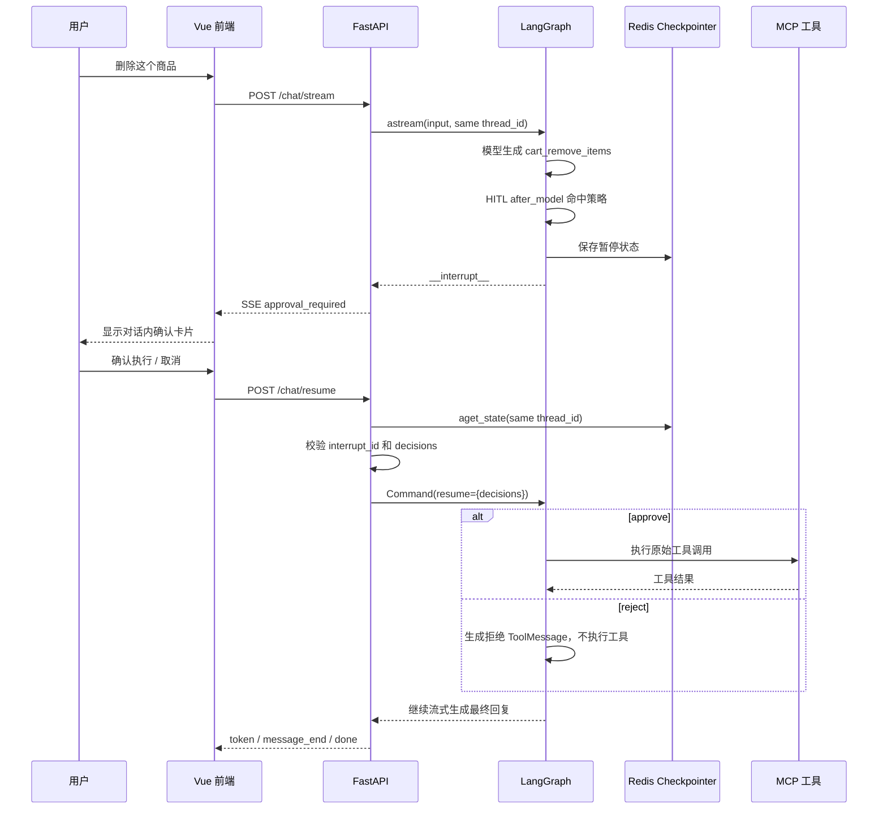

# LangChain Agent 中间件、HITL 与恢复执行

> 适用项目：`mall-agent`  
> 当前依赖：LangChain `1.4.2`、LangGraph `1.2.12`  
> 文档目标：既说明官方机制，也逐段对应本项目代码，最终能够独立配置中间件、接入 HITL、实现暂停与恢复并完成排错。

## 1. 先建立整体认识

`create_agent()` 返回的不是一个简单函数，而是一个已经编译好的 LangGraph Agent 图。它的核心循环是：

```text
用户消息
   ↓
调用模型
   ↓
模型是否生成工具调用？ ── 否 ──→ 返回最终回复
   │
   是
   ↓
执行工具
   ↓
把 ToolMessage 交回模型
   └──────────────────────────→ 再次判断
```

中间件是在循环的不同位置插入控制逻辑：

```text
before_agent
    ↓
before_model → wrap_model_call → after_model
                                  ↓
                         HITL 在这里检查工具调用
                                  ↓
                         wrap_tool_call → 工具
    ↑                             ↓
    └──────────── 模型继续处理 ToolMessage
                                  ↓
                              after_agent
```

因此，中间件适合处理：

- 模型和工具重试；
- 调用次数与成本限制；
- 危险工具审批；
- 日志、监控、动态提示词；
- 输入输出过滤与上下文管理。

官方明确说明：中间件不是独立运行时。中间件 hook 会进入 `create_agent()` 返回的 LangGraph 中；把该 Agent 放入更大的 `StateGraph` 后，中间件仍然有效。

---

## 2. 本项目当前使用的中间件

文件：`app/agents/cart.py`

```python
middleware=[
    model_call_limit,
    tool_call_limit,
    model_retry_middleware,
    tool_retry_middleware,
    human_in_the_loop_middleware,
]
```

| 中间件 | 当前配置 | 解决的问题 |
|---|---|---|
| `ModelCallLimitMiddleware` | 每次运行最多 8 次模型调用 | 防止 Agent 循环失控与费用异常 |
| `ToolCallLimitMiddleware` | 每次运行最多 12 次工具调用 | 防止工具循环或外部接口被大量调用 |
| `ModelRetryMiddleware` | 最多重试 2 次 | 应对模型接口的临时网络故障、限流等 |
| `ToolRetryMiddleware` | 只重试策略中允许重试的工具，最多 2 次 | 应对 MCP/商城查询接口的临时故障 |
| `HumanInTheLoopMiddleware` | 删除、清空、清理失效商品需要审批 | 在产生副作用前暂停并等待用户决定 |

这里的“一次运行”指一次 Agent invocation，通常对应一条用户消息触发的本轮处理；不是整个会话。

---

## 3. 调用次数限制中间件

### 3.1 ModelCallLimitMiddleware

当前代码：

```python
ModelCallLimitMiddleware(
    run_limit=8,
    exit_behavior="end",
)
```

参数含义：

| 参数 | 含义 |
|---|---|
| `run_limit` | 单次 invocation 最多调用模型多少次；下一轮用户消息重新计数 |
| `thread_limit` | 相同 `thread_id` 的整个会话最多调用多少次；需要 Checkpointer 才能跨 invocation 保存计数 |
| `exit_behavior="end"` | 达到上限后优雅结束，并生成达到限制的说明消息 |
| `exit_behavior="error"` | 达到上限后抛出异常 |

注意：一次用户请求可能多次调用模型。例如：

```text
模型决定查询购物车          第 1 次
工具返回购物车数据
模型根据工具结果生成回复    第 2 次
```

所以 `run_limit=8` 不是限制用户发送 8 条消息，而是限制这一轮 Agent 内部的模型循环次数。

### 3.2 ToolCallLimitMiddleware

当前代码：

```python
ToolCallLimitMiddleware(
    run_limit=12,
    exit_behavior="end",
)
```

主要参数：

| 参数 | 含义 |
|---|---|
| `tool_name` | 只限制某个工具；省略时限制全部工具调用总数 |
| `run_limit` | 当前 invocation 的工具调用上限 |
| `thread_limit` | 整个 thread 的工具调用上限，需要 Checkpointer |
| `exit_behavior="continue"` | 阻止超限调用，用错误 `ToolMessage` 告诉模型，由模型决定下一步 |
| `exit_behavior="error"` | 立即抛出异常 |
| `exit_behavior="end"` | 立即结束；更适合限制单个工具的场景 |

本项目当前使用“全局限制 + `end`”。这在顺序调用工具时有效，但官方特别提示：当同一条 AI 消息包含多个并行工具调用时，`end` 的适用范围有限。后续启用并行工具调用后，应重点回归该场景；可根据产品行为改为全局 `continue/error`，或为关键工具分别设置限制。

---

## 4. 重试中间件

### 4.1 max_retries 的准确含义

```python
max_retries=2
```

表示“首次失败后最多再试 2 次”，所以最多是：

```text
首次调用 + 2 次重试 = 3 次总尝试
```

### 4.2 退避等待

当前模型和工具重试都使用：

```python
initial_delay=1.0
backoff_factor=2.0
max_delay=8.0
jitter=True
```

基础等待大致为：

```text
第一次重试前：1 秒
第二次重试前：2 秒
后续：4 秒、8 秒，最大不超过 8 秒
```

`jitter=True` 会加入随机抖动，避免多个请求在服务恢复瞬间同时重试。

### 4.3 ModelRetryMiddleware

当前代码的失败策略：

```python
ModelRetryMiddleware(
    max_retries=2,
    ...,
    on_failure="error",
)
```

含义：模型调用重试耗尽后重新抛出异常，最终由上层 `/chat/stream` 的异常处理转换成 SSE `error` 事件。

`retry_on` 决定哪些异常可以重试。未传时使用 LangChain 默认判断；明确标记为不可重试的模型错误不会被重复请求。

### 4.4 ToolRetryMiddleware

本项目没有重试所有购物车工具，而是从工具策略中筛选：

```python
retryable_tool_names = get_retryable_tool_names(
    CART_TOOL_POLICIES,
)

ToolRetryMiddleware(
    tools=retryable_tool_names,
    max_retries=2,
    ...,
    on_failure="continue",
)
```

`on_failure="continue"` 表示重试耗尽后，将失败转换为错误 `ToolMessage` 返回给模型，让模型生成用户可读的失败说明，而不是直接结束整个 Agent。

### 4.5 为什么只重试读取工具

文件：`app/agents/tool_policy.py`

```python
"cart_get": ToolPolicy(
    risk=ToolRisk.READ_ONLY,
    retryable=True,
)
```

添加商品、修改数量等写操作没有设置 `retryable=True`。原因是客户端超时不代表服务端没有成功：

```text
服务端已经加购成功
        ↓
返回响应时连接中断
        ↓
客户端自动重试
        ↓
同一商品可能被重复加购
```

判断一个工具是否适合自动重试，至少检查：

1. 是否只读；
2. 是否天然幂等；
3. 是否携带可靠的幂等键；
4. 超时后能否查询第一次执行结果；
5. 重复执行是否会产生额外副作用。

---

## 5. HITL 到底做了什么

HITL 是 Human-in-the-Loop，即“人在执行链路中”。它不是让模型先用文字询问“是否确认”，而是在模型已经生成危险工具调用、工具尚未执行时，由运行时强制暂停。

本项目配置：

```python
HumanInTheLoopMiddleware(
    interrupt_on={
        "cart_remove_items": {
            "allowed_decisions": ["approve", "reject"],
            "description": "将删除选中的购物车商品，批准后立即执行。",
        },
        "cart_clear": {
            "allowed_decisions": ["approve", "reject"],
            "description": "将清空购物车中的全部商品，批准后立即执行。",
        },
    },
)
```

### 5.1 interrupt_on

`interrupt_on` 的 key 必须与工具的 `.name` 完全一致。

值可以是：

| 配置 | 行为 |
|---|---|
| `True` | 暂停，并允许全部官方决策类型 |
| `False` | 自动通过，不暂停 |
| 配置对象 | 指定允许的决策、描述和条件 |
| key 不存在 | 默认自动通过 |

### 5.2 四种官方决策

| 决策 | 含义 | 是否执行真实工具 |
|---|---|---|
| `approve` | 按模型给出的原始参数执行 | 是 |
| `edit` | 修改工具名或参数后执行 | 是 |
| `reject` | 拒绝执行，并把拒绝原因作为反馈交给模型 | 否 |
| `respond` | 人直接提供一个成功的工具结果，适合 `ask_user` 类工具 | 否 |

本项目的接口模型只开放：

```python
Literal["approve", "reject"]
```

这是有意缩小能力范围：购物车删除只需要批准或取消，不允许浏览器修改 `basketIds`，也不把 `respond` 当成拒绝使用。

### 5.3 HITL 的执行时机

官方中间件使用 `after_model` hook，生命周期为：

```text
1. 模型产生 AIMessage 和 tool_calls
2. HumanInTheLoopMiddleware 检查工具名称
3. 命中 interrupt_on 策略
4. 生成 HITLRequest
5. interrupt() 暂停图
6. Checkpointer 保存状态
7. 外部应用展示审批界面
8. 外部应用用 Command(resume=...) 恢复
9. approve 才执行工具；reject 跳过工具
10. 工具结果或拒绝反馈重新交给模型生成最终回复
```

关键点：**弹出审批时，危险工具还没有执行。**

### 5.4 中断负载

HITL 中断的 `value` 主要包含：

```python
{
    "action_requests": [
        {
            "name": "cart_remove_items",
            "args": {"basketIds": [3]},
            "description": "将删除选中的购物车商品，批准后立即执行。",
        }
    ],
    "review_configs": [
        {
            "action_name": "cart_remove_items",
            "allowed_decisions": ["approve", "reject"],
        }
    ],
}
```

`action_requests` 是“准备做什么”，`review_configs` 是“用户可以如何决定”。当一次产生多个待审批工具调用时，每个 action 都必须有一个 decision，而且顺序必须一致。

---

## 6. Checkpointer、conversation_id 与 thread_id

HITL 必须具备：

1. Checkpointer；
2. 稳定的 `thread_id`；
3. 中断后使用同一 `thread_id` 恢复。

本项目在 `app/memory/checkpointer.py` 使用：

```python
checkpointer = AsyncRedisSaver(
    redis_url=settings.REDIS_URL,
)
```

在 `app/main.py` 的生命周期中构建 Graph：

```python
async with checkpointer as saver:
    app.state.mall_graph = build_graph(saver)
```

主图编译时传入：

```python
graph.compile(checkpointer=checkpointer)
```

### 6.1 三个 ID 不要混淆

| ID | 来源 | 作用 |
|---|---|---|
| `user_id` | Java 鉴权结果 | 隔离不同用户的数据 |
| `conversation_id` | 前端保存并回传 | 表示用户看到的一次聊天会话 |
| `thread_id` | Python 后端组合生成 | Checkpointer 查找图状态的持久化指针 |
| `interrupt_id` | LangGraph 中断对象 | 标识当前待处理的具体中断，防止旧弹窗误操作 |

本项目的 `thread_id`：

```python
thread_id = (
    f"user:{user_context.user_id}"
    f":conversation:{conversation_id}"
)
```

前端不直接提交 `thread_id`，避免客户端伪造另一个用户的线程路径。

### 6.2 为什么恢复必须使用同一个 thread_id

可以把 Checkpointer 想象成：

```text
thread_id ──→ 最新 checkpoint ──→ 暂停节点、State、messages、pending interrupt
```

恢复时换一个 `thread_id`，LangGraph 查到的是一个新线程，自然没有待审批状态。

### 6.3 本项目的主图与业务 Agent 关系

本项目不是把所有工具直接放到主图，而是：

```text
主图
  intent 节点
      ↓
  cart_node
      ↓
  动态创建 cart_agent
      ↓
  cart_agent 内部执行 MCP 工具循环
```

`app/graph/main_graph.py` 把 Checkpointer 传给主图；`cart_node.py` 负责创建当前用户工具并调用 `cart_agent`。因此阅读代码时要区分：

- **主图 State**：包括意图、当前 Agent、会话消息以及暂停位置；
- **业务 Agent State**：包括业务 Agent 内部的模型消息、工具调用和 HITL 中断；
- **Redis Checkpointer**：提供跨请求恢复所需的持久化能力。

实际开发原则：

1. 不要在每次用户请求里重新创建一套独立的持久化连接；
2. 新业务 Agent 沿用主图的 `thread_id` 约定；
3. `/chat/resume` 不需要知道购物车或订单的业务细节，只负责定位中断、校验 decision 并恢复图；
4. 业务 Agent 的危险工具都必须有稳定的工具名和可展示描述。

如果未来把业务 Agent 改成显式 LangGraph 子图，应重新确认子图的 checkpoint namespace 和父图状态是否符合预期；需要跨图共享的长期用户资料应使用 Store，而不是把所有内容塞进 thread checkpoint。

---

## 7. 本项目从暂停到恢复的完整链路



### 7.1 首次流式请求

接口：

```http
POST /chat/stream
```

核心调用：

```python
async for part in app.state.mall_graph.astream(
    initial_input,
    config={
        "configurable": {
            "thread_id": thread_id,
        }
    },
    stream_mode=["messages", "updates", "tasks"],
    subgraphs=True,
    version="v2",
):
    ...
```

本项目根据 `part["type"]` 分流：

| stream type | 用途 |
|---|---|
| `messages` | 提取模型 token 和工具调用片段 |
| `updates` | 读取 State 更新以及 `__interrupt__` |
| `tasks` | 生成 Agent/工具开始、结束事件 |

检测到：

```python
interrupts = data.get("__interrupt__")
```

就向前端发送：

```text
event: approval_required
data: {
  "conversation_id": "...",
  "interrupt_id": "...",
  "actions": [...],
  "review_configs": [...]
}
```

随后生成器 `return`。这表示本次 HTTP SSE 响应结束；Graph 的暂停状态已经写入 Redis，并没有丢失。

### 7.2 恢复接口先读取状态

接口：

```http
POST /chat/resume
```

请求示例：

```json
{
  "conversation_id": "CONVERSATION_ID",
  "interrupt_id": "INTERRUPT_ID",
  "decisions": [
    {"type": "approve"}
  ]
}
```

后端先读取快照：

```python
snapshot = await app.state.mall_graph.aget_state(config)
```

然后校验：

1. 当前线程是否真的存在 pending interrupt；
2. 请求的 `interrupt_id` 是否仍是当前中断；
3. decision 数量是否等于 action 数量；
4. 每个 decision 是否在对应 `allowed_decisions` 中。

这些校验能防止：

- 重复点击旧审批按钮；
- 使用旧页面审批已经结束的操作；
- 少传或多传 decision；
- 前端提交当前工具不允许的 decision 类型。

### 7.3 Command(resume=...) 才是真正恢复

```python
Command(
    resume={
        "decisions": decisions,
    }
)
```

它必须与原来的 `config` 一起传回同一个 Graph：

```python
async for part in app.state.mall_graph.astream(
    Command(resume={"decisions": decisions}),
    config=config,
    ...,
):
    ...
```

不要把恢复写成新的普通输入：

```python
# 这是新的一轮输入，不是恢复中断
graph.ainvoke({"messages": [HumanMessage("确认")]}, config=config)
```

“用户发送文字确认”与“运行时恢复中断”是两个概念。当前产品使用确认卡片直接调用 `/chat/resume`，只保留一次确认。

### 7.4 approve 与 reject 的区别

批准：

```json
{"type": "approve"}
```

- 执行原始工具和原始参数；
- 工具结果交给模型；
- 模型生成“删除成功”等最终回复。

拒绝：

```json
{
  "type": "reject",
  "message": "用户取消了本次删除操作，请不要再次调用该删除工具"
}
```

- 不执行工具；
- 拒绝原因作为反馈交给模型；
- 模型生成“操作已取消”等最终回复。

---

## 8. 中断恢复最容易出错的地方

### 8.1 没有 Checkpointer

现象：可以产生 interrupt，但下一次请求找不到暂停现场。

检查：

```python
graph.compile(checkpointer=checkpointer)
```

生产环境需要持久化 Checkpointer。纯内存 Saver 会在进程重启后丢失状态。

### 8.2 恢复时 thread_id 不一致

现象：`snapshot.tasks` 没有 interrupts，接口返回 409。

排查时同时记录：

```text
user_id
conversation_id
最终生成的 thread_id
interrupt_id
```

### 8.3 把“确认”当作普通聊天消息

现象：Agent 重新理解一次“确认”，可能再次生成同一工具调用，然后出现第二个审批窗口。

正确方式：确认按钮调用 `/chat/resume` 并提交 `Command(resume=...)` 所需决策。

### 8.4 decisions 数量或顺序错误

一个 interrupt 可能包含多个 action：

```text
actions[0] ↔ decisions[0]
actions[1] ↔ decisions[1]
```

不能只发送一个全局 `approved=true`。

### 8.5 中断前执行了副作用

LangGraph 恢复 interrupt 时，会从发生中断的节点开头重新执行该节点。因此，直接使用 `interrupt()` 编写自定义节点时，不要在中断前执行非幂等副作用：

```python
def bad_node(state):
    charge_user()          # 恢复时可能再次运行
    approved = interrupt("是否继续？")
```

应先中断，批准后再执行：

```python
def good_node(state):
    approved = interrupt("是否扣款？")
    if approved:
        charge_user()
```

本项目使用官方 `HumanInTheLoopMiddleware`，它在工具执行前中断，正好满足这一要求。

### 8.6 对写工具进行盲目自动重试

HITL 只保证“执行前审批”，不自动保证工具幂等。一个已经批准的写工具如果因响应超时被重试，仍可能重复产生副作用。因此重试策略和审批策略必须分别设计。

### 8.7 interrupt payload 不是 JSON 可序列化数据

自定义 `interrupt()` 时只传字符串、数字、布尔值、列表、字典等可序列化内容，不要传数据库连接、函数、复杂运行时对象。

---

## 9. 手工测试

以下命令使用占位符，不把真实 Token 写进文档。

### 9.1 发起危险操作

```bash
curl -N -X POST 'http://127.0.0.1:18082/chat/stream' \
  -H 'Authorization: TOKEN' \
  -H 'Content-Type: application/json' \
  -H 'Accept: text/event-stream' \
  --data '{
    "messages": "删除购物车中的这个商品",
    "conversation_id": "hitl-demo-001"
  }'
```

期望终止事件不是 `done`，而是：

```text
event: approval_required
data: {"conversation_id":"hitl-demo-001","interrupt_id":"...",...}
```

此时验证商品仍然存在，证明工具还未执行。

### 9.2 批准

```bash
curl -N -X POST 'http://127.0.0.1:18082/chat/resume' \
  -H 'Authorization: TOKEN' \
  -H 'Content-Type: application/json' \
  -H 'Accept: text/event-stream' \
  --data '{
    "conversation_id": "hitl-demo-001",
    "interrupt_id": "INTERRUPT_ID",
    "decisions": [{"type":"approve"}]
  }'
```

期望：出现工具执行事件，最后收到 `done`。

### 9.3 拒绝

重新创建一个新的待审批会话，再提交：

```json
{
  "conversation_id": "hitl-demo-002",
  "interrupt_id": "INTERRUPT_ID",
  "decisions": [
    {
      "type": "reject",
      "message": "用户取消操作，请结束本次删除流程"
    }
  ]
}
```

期望：工具不执行，Agent 生成取消说明，最后收到 `done`。

### 9.4 必做回归矩阵

| 场景 | 期望结果 |
|---|---|
| 只读查询 | 不产生 `approval_required` |
| 删除商品 | 工具执行前产生一次审批 |
| approve | 工具只执行一次 |
| reject | 工具执行次数为 0 |
| 重复提交相同 interrupt | 第二次返回 409 |
| 使用错误 interrupt_id | 返回 409 |
| decision 数量不匹配 | 返回 400 |
| 暂停后重启 Python，再恢复 | Redis 状态仍可恢复 |
| A 用户使用 B 用户的 conversation_id | 查不到 B 的待审批状态 |
| 前端取消 | 卡片立即消失，随后流式显示取消回复 |

---

## 10. 如何为新 Agent 接入相同能力

### 第一步：定义工具策略

```python
ORDER_TOOL_POLICIES = {
    "order_get": ToolPolicy(
        risk=ToolRisk.READ_ONLY,
        retryable=True,
    ),
    "order_cancel": ToolPolicy(
        risk=ToolRisk.DANGEROUS_WRITE,
        requires_approval=True,
    ),
}
```

### 第二步：只给合适的工具配置重试

```python
retryable_names = get_retryable_tool_names(
    ORDER_TOOL_POLICIES,
)

tool_retry = ToolRetryMiddleware(
    tools=retryable_names,
    max_retries=2,
    on_failure="continue",
)
```

### 第三步：配置审批

```python
hitl = HumanInTheLoopMiddleware(
    interrupt_on={
        "order_cancel": {
            "allowed_decisions": ["approve", "reject"],
            "description": "将取消该订单，确认后立即执行。",
        },
    }
)
```

### 第四步：放入 create_agent

```python
agent = create_agent(
    model=model,
    tools=tools,
    middleware=[
        ModelCallLimitMiddleware(run_limit=8),
        ToolCallLimitMiddleware(run_limit=12),
        ModelRetryMiddleware(max_retries=2),
        tool_retry,
        hitl,
    ],
)
```

### 第五步：验证主图 Checkpointer 与恢复接口

如果所有业务 Agent 共用当前主图和 `/chat/resume` 协议，新增工具通常只需确保：

- 工具名与 `interrupt_on` 的 key 完全一致；
- `approval_required` 中包含前端需要展示的信息；
- 前端存在用户可读的工具名称与描述；
- 恢复接口允许该工具配置的 decision 类型；
- approve/reject 都有真实测试。

---

## 11. 推荐学习顺序

### 第一轮：掌握概念

1. 能画出 Agent 的 model → tools → model 循环；
2. 能说明 middleware 与 LangGraph 的关系；
3. 能区分重试、调用限制和 HITL；
4. 能解释为什么 HITL 需要 Checkpointer 与 thread_id。

### 第二轮：掌握代码

按顺序阅读：

1. `app/agents/tool_policy.py`
2. `app/agents/cart.py`
3. `app/memory/checkpointer.py`
4. `app/graph/main_graph.py`
5. `app/main.py` 中 `/chat/stream`
6. `app/main.py` 中 `/chat/resume`
7. `app/schemas/chat.py`
8. `app/schemas/stream.py`

### 第三轮：自己做实验

1. 把某个只读工具临时设为需要审批，观察 interrupt；
2. 分别提交 approve 和 reject；
3. 暂停后重启 Python 再恢复；
4. 修改 interrupt_id，观察 409；
5. 模拟查询工具临时失败，观察退避重试；
6. 模拟写工具超时，理解为什么默认不重试；
7. 将 `run_limit` 调小，观察 Agent 如何结束。

做到下面这些，就算已经掌握：

- 能独立为一个新工具选择风险级别；
- 能判断是否可自动重试；
- 能配置审批决策；
- 能从 `snapshot.tasks[*].interrupts` 找到待审批操作；
- 能使用同一 `thread_id` 和 `Command(resume=...)` 恢复；
- 能判断 400、409、SSE `error` 分别应该在哪一层排查。

---

## 12. 官方资料

- [LangChain Middleware 概览](https://docs.langchain.com/oss/python/langchain/middleware/overview)
- [LangChain 预置中间件](https://docs.langchain.com/oss/python/langchain/middleware/built-in)
- [LangChain Human-in-the-loop](https://docs.langchain.com/oss/python/langchain/human-in-the-loop)
- [LangGraph Interrupts](https://docs.langchain.com/oss/python/langgraph/interrupts)
- [LangGraph Persistence](https://docs.langchain.com/oss/python/langgraph/persistence)
- [LangChain Middleware API Reference](https://reference.langchain.com/python/langchain/middleware)

> 说明：官方新文档的流式示例主要使用 `stream_events(..., version="v3")`。本项目当前使用 `astream(..., version="v2")` 并自行转换为标准 SSE。两者表达的核心过程一致：首次运行遇到 interrupt 后暂停，外部收集决定，再使用同一 thread 配合 `Command(resume=...)` 恢复。
