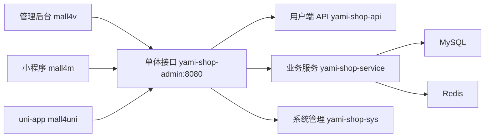

# 整体架构

Mall4j 开源版是前后端分离的单体多模块架构。



## 接口模块与运行进程

| 代码模块 | 面向对象 | 运行方式 |
| --- | --- | --- |
| `yami-shop-admin` | 管理后台、运营人员、系统管理员 | 唯一启动类，监听 `8080` |
| `yami-shop-api` | 小程序、H5、用户端 | 被 `yami-shop-admin` 依赖，不单独启动 |

## 共享能力

两个接口工程共同复用：

- `yami-shop-service`：业务逻辑和数据访问。
- `yami-shop-bean`：实体、DTO、VO。
- `yami-shop-common`：通用响应、异常、工具、注解。
- `yami-shop-security-common/api/admin`：登录、Token、权限、用户上下文。

## 第一阶段理解重点

先把这条链路看懂：

```text
管理后台页面 -> 管理端 Controller -> Service -> Mapper -> MySQL
```

二次开发后台功能基本都按这条链路扩展。
