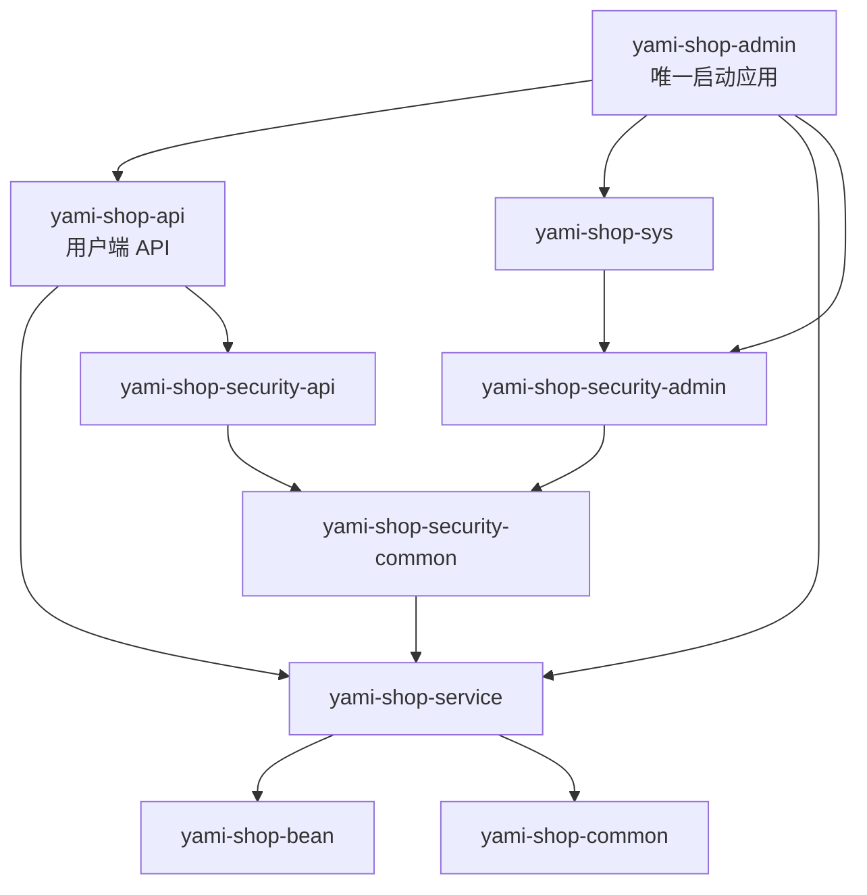

# 项目结构与模块边界

本文是当前二开版本的结构说明，以代码现状为准。项目按“一个 Java 单体后端、多个前端应用”组织：Maven 中有多个代码模块，但运行时只启动一个 Spring Boot 应用。

## 1. 顶层目录

```text
/Users/admin/code/ceshi/
├── mall4j/                         # Java 后端仓库
│   ├── yami-shop-admin/            # 唯一可运行后端模块
│   ├── yami-shop-api/              # 用户端 API 代码模块，不单独启动
│   ├── yami-shop-service/          # 业务服务、Mapper、数据访问
│   ├── yami-shop-bean/             # Entity、DTO、VO 等数据对象
│   ├── yami-shop-common/           # 通用响应、异常、工具和基础配置
│   ├── yami-shop-sys/              # 菜单、角色、系统用户、日志等管理能力
│   ├── yami-shop-security-common/  # 公共认证、Token、过滤器和权限基础
│   ├── yami-shop-security-api/     # 用户端登录和用户身份模型
│   ├── yami-shop-security-admin/   # 管理员登录和管理端身份模型
│   ├── db/                         # MySQL 初始化脚本
│   ├── deploy/                     # systemd 等部署文件
│   └── doc/                        # 项目文档
└── front-end/                      # 前端项目，与后端仓库同级
    ├── mall4v/                     # Vue 管理后台
    ├── mall4uni/                   # uni-app 用户端
    └── mall4m/                     # 原生微信小程序用户端
```

从后端目录执行前端命令时，前端路径使用 `../front-end/...`。前端不参与后端 Maven 构建，也不应放回 `mall4j` 目录。

## 2. 后端模块职责

| 模块 | 类型 | 职责 | 是否启动 |
| --- | --- | --- | --- |
| `yami-shop-admin` | Spring Boot 应用 | 管理端 Controller、配置和唯一启动类；同时承载用户端 API 模块 | 是 |
| `yami-shop-api` | Java 依赖模块 | 用户端商品、购物车、订单、支付、地址、会员等 API 和监听器 | 否 |
| `yami-shop-service` | 业务模块 | Service、Mapper、Mapper XML、核心业务逻辑和数据访问 | 否 |
| `yami-shop-bean` | 模型模块 | 数据库实体、DTO、VO、查询对象 | 否 |
| `yami-shop-common` | 基础模块 | 统一响应、异常、工具、公共配置、缓存和基础设施 | 否 |
| `yami-shop-sys` | 系统模块 | 系统菜单、角色、管理员、操作日志和系统配置 | 否 |
| `yami-shop-security-common` | 安全基础模块 | Token、认证过滤器、公共登录能力和权限基础 | 否 |
| `yami-shop-security-api` | 安全用户端模块 | 用户端登录 Controller、用户身份模型和用户端安全工具 | 否 |
| `yami-shop-security-admin` | 安全管理端模块 | 管理员身份模型、验证码登录和管理端安全工具 | 否 |

安全模块现在都是根 Maven 工程的直接子模块，不再套在 `yami-shop-security` 聚合目录下。它们是编译期的代码边界，不代表三个运行服务。

## 3. 依赖关系



`yami-shop-admin/pom.xml` 直接依赖 `yami-shop-api`，所以用户端 Controller 会和管理端 Controller 一起进入同一个 Jar。`WebApplication` 是唯一标准启动类，默认监听 `8080`。

## 4. 唯一启动方式

不要再启动 `ApiApplication`；该独立入口已经移除。后端只使用：

```text
yami-shop-admin/src/main/java/com/yami/shop/admin/WebApplication.java
```

在后端仓库根目录构建：

```bash
mvn -pl yami-shop-admin -am -DskipTests package
```

启动 Jar：

```bash
java -jar yami-shop-admin/target/yami-shop-admin-0.0.1-SNAPSHOT.jar
```

后端地址：

```text
http://127.0.0.1:8080
接口文档：http://127.0.0.1:8080/doc.html
```

MySQL 和 Redis 仍是运行前置依赖，默认配置位于 `yami-shop-admin/src/main/resources/application-dev.yml`。

## 5. 前端边界

| 前端 | 路径 | 用途 | API 地址配置 |
| --- | --- | --- | --- |
| `mall4v` | `../front-end/mall4v` | 管理后台 | `.env.development` 的 `VITE_APP_BASE_API` |
| `mall4uni` | `../front-end/mall4uni` | H5、App 等用户端 | `.env.*` 的 `VITE_APP_BASE_API` |
| `mall4m` | `../front-end/mall4m` | 原生微信小程序用户端 | `utils/config.js` 的 `domain` |

三个前端都调用同一个 `http://127.0.0.1:8080` 后端。前端开发服务器端口只属于前端页面，不是后端服务端口。

## 6. 二开定位规则

### 新增用户端功能

1. 数据对象放在 `yami-shop-bean`。
2. Service、Mapper 和 XML 放在 `yami-shop-service`。
3. 用户端 Controller 放在 `yami-shop-api/src/main/java/com/yami/shop/api/controller/`。
4. 用户端登录或 Token 相关代码放在 `yami-shop-security-api` 或 `yami-shop-security-common`。
5. 用户端页面放在 `../front-end/mall4uni` 或 `../front-end/mall4m`。

### 新增管理端功能

1. 管理端 Controller 放在 `yami-shop-admin/src/main/java/com/yami/shop/admin/controller/`。
2. 管理菜单、角色和操作日志使用 `yami-shop-sys`。
3. 管理后台页面放在 `../front-end/mall4v/src/views/modules/`，CRUD 配置放在 `../front-end/mall4v/src/crud/`。

### 接入 Python 电商智能体

Python 服务建议继续作为后端仓库的同级项目，例如 `../mall4j-agent/`。它通过 HTTP 调用 `mall4j` 的 `8080` 接口，不直接依赖 Java 内部模块，也不把 Python 代码放进 `yami-shop-admin`。

## 7. 已清理内容

- 删除项目内未被 Maven 引用的 `yami-shop-app`。
- 删除 `yami-shop-api` 的独立启动类、独立 Spring Boot 打包配置和重复运行配置。
- 删除嵌套的 `yami-shop-security` 聚合工程，保留并提升三个实际使用的安全模块。
- 移除后端仓库内的 `front-end` 目录，前端源码保留在后端仓库同级的 `../front-end`。

后续新增模块时，先判断它是“代码依赖模块”还是“可运行应用”。只有确实需要独立端口和独立生命周期的应用，才新增启动类和部署单元。
